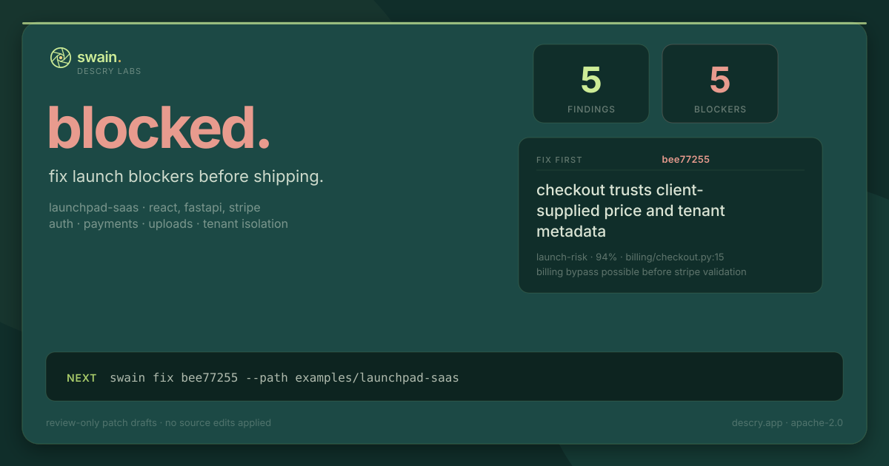

# Swain

**Your local AI security lead for vibe coders shipping SaaS fast.**

Swain is for solo builders and small teams who have a real app that is almost
ready to ship, but still need a plain-English launch verdict: can this ship,
what blocks release, and what should be fixed first?



Launch page: [docs/launch/index.html](docs/launch/index.html)

## Quickstart

Install once, then run `swain` from any terminal:

```bash
curl -fsSL https://raw.githubusercontent.com/Descry-Technologies/Swain/main/install.sh | sh
cd /path/to/your/repo
swain
```

The installer clones Swain's source into `~/.swain/source`, installs the
`swain` command, and keeps `uv` hidden as an implementation detail. The first
`swain` launch explains what Swain reads and writes, then asks whether scans
should use Claude CLI, Codex CLI, or hybrid mode. It also lets you choose CLI
default models or exact model ids, and a scan speed so quota use is explicit.
Setup builds a local project profile without spending model quota.

Update the source-installed command without PyPI:

```bash
swain update
```

From outside the repo:

```bash
swain /path/to/your/repo
```

For the offline demo:

```bash
swain demo
```

`swain demo` does not spend Claude/Codex quota.

After a scan, export a shareable launch verdict:

```bash
swain launch-card --out swain-launch-card.svg
```

The card is a 1200x630 SVG built from local scan history. It is designed for
LinkedIn posts, Product Hunt gallery prep, and launch updates without exposing
raw worker logs or source code.

`doctor` checks repo setup, bundled playbooks, local package hygiene, and your
Claude/Codex CLIs. If a worker is missing, out of quota, or unauthenticated,
Swain reports that as expected degradation instead of hiding it as a scan
failure.

See [docs/source-install.md](docs/source-install.md) for prerequisites and
common setup failures. Contributors can still use the checkout workflow there.

## What It Catches

Swain focuses on security issues that block a SaaS launch:

- auth and session mistakes
- billing trust boundaries and webhook verification
- unsafe uploads and path handling
- tenant isolation and object-level authorization
- hardcoded secrets and risky env handling
- SQL/data-access injection paths
- React XSS and unsafe HTML rendering

It is not trying to replace Semgrep, Snyk, or a professional security audit.
It gives a human, fix-first review for the places a fast-moving app is most
likely to get hurt.

## Fix First

`swain status` summarizes the latest scan history and chooses the first issue
to fix. In the public demo, the top finding is a launch-risk billing bug:

```text
Fix first: `bee77255` - Checkout trusts client-supplied price and tenant metadata
  Next: swain fix bee77255 --path examples/launchpad-saas
  Wrong? swain feedback bee77255 fp --path examples/launchpad-saas
```

`swain fix <id>` asks Codex for a reviewable patch draft. It does not silently
apply code changes. `swain feedback <id> fp` teaches Swain when a finding is a
false positive for this repo.

## Launch Card

`swain launch-card` turns the latest scan history into a concise ship/no-ship
card:

- launch verdict: `BLOCKED`, `REVIEW`, `READY`, or `NO SCAN YET`
- open finding count and launch-blocker count
- top issue and exact next command
- reminder that patch drafts are review-only

This is the intended social artifact for build-in-public updates: show the
launch decision, not a wall of terminal output.

## Demo

Use [examples/launchpad-saas](examples/launchpad-saas) for public screenshots,
recordings, and offline evaluation. It is an intentionally vulnerable React +
FastAPI SaaS app with auth, billing, uploads, tenant data, SQL, secrets, and XSS
risks.

Demo assets:

- [launch-card.svg](docs/assets/demo/launch-card.svg)
- [scan-flow.gif](docs/assets/demo/scan-flow.gif)
- [status.svg](docs/assets/demo/status.svg)
- [doctor.svg](docs/assets/demo/doctor.svg)
- [finding-narrative.svg](docs/assets/demo/finding-narrative.svg)
- [tui-first-run.svg](docs/assets/demo/tui-first-run.svg)
- [transcript.md](docs/assets/demo/transcript.md)

Regenerate them with:

```bash
uv run python scripts/capture_demo_assets.py
```

ImageMagick's `convert` binary is only required for regenerating
`scan-flow.gif`.

## Privacy And Trust

Swain runs locally and uses your installed `claude` and `codex` CLIs as model
workers by default. Advanced users can switch a worker to direct API mode in
`swain setup`, using `ANTHROPIC_API_KEY` or `OPENAI_API_KEY` and exact model ids.
It stores project memory under `.swain/` in the target repo. Scans use
isolated file copies for worker analysis, and the planner excludes local secret
material such as `.env`, private keys, and PEM files before selecting files for
model workers.

Read [docs/privacy-and-trust.md](docs/privacy-and-trust.md) before scanning
sensitive code. The short version: Swain is local-first, but Claude/Codex CLIs
are still third-party tools, so do not scan highly sensitive private code unless
you trust those local CLI integrations.

## How It Works

Swain builds a local project profile, runs deterministic checks first, routes
focused playbooks to Claude/Codex workers, records finding history, and then
answers the practical question: what should you fix before launch?

Memory layout:

```text
.swain/
  config.yaml
  profile.yaml
  conventions.yaml
  playbooks/
    active/
    generated/
  demo-history/
  .local/
    history/
    calibration.yaml
    schedule.yaml
```

`config.yaml`, `profile.yaml`, `conventions.yaml`, reviewed custom playbooks,
and the public demo's `demo-history/` fixture can be committed. `.swain/.local/`
is local-only and ignored.

## Contributing

Start with [CONTRIBUTING.md](CONTRIBUTING.md), then run the release gates:

```bash
uv run ruff check scripts src tests examples
uv run pytest -q
uv build --wheel
```

Security reports go through [SECURITY.md](SECURITY.md).

## License

Apache-2.0. See [LICENSE](LICENSE).
